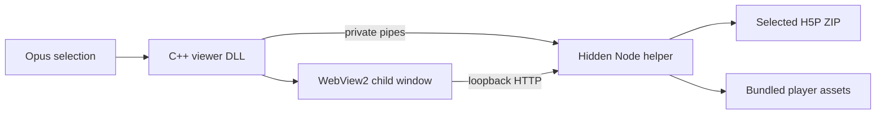

# Architecture

The DLL exports the Opus `DVP_*` interface and identifies `.h5p` only. A shared native
implementation supports the DLL and standalone host. Each viewer owns its helper,
job object and browser profile. Closing it stops only its helper.

Paths cross JSON-lines process pipes. The helper binds `127.0.0.1` on an ephemeral
port with opaque session paths. Requests are read-only, with Host/Origin checks and
byte ranges; there is no general filesystem endpoint. Selection generations invalidate
old URLs and pending responses.

The player uses a same-origin Service Worker. WebView2 host objects and messaging are
disabled. External requests/navigation, permissions, downloads and new windows are
restricted. Content has no filesystem or command bridge. This is not a comprehensive
security-audit claim; use trusted H5P content.

Profiles/logs are under `%LOCALAPPDATA%\ACS\H5PViewer`. Lock markers distinguish active
profiles from abandoned profiles eligible for cleanup. The DLL stays loaded for the
host process lifetime to protect asynchronous callbacks.

Autoplay and learner resume are disabled. Preflight limits the ZIP central directory
to 32 MiB and `h5p.json` to 1 MiB; ZIP64 and split archives are rejected. Source packages
are not rewritten or extracted by the helper.

Optional debug ports exist for development. Production setup enables none. The host
supports `--debug-port` in direct-core mode; it is not a normal end-user setting.
