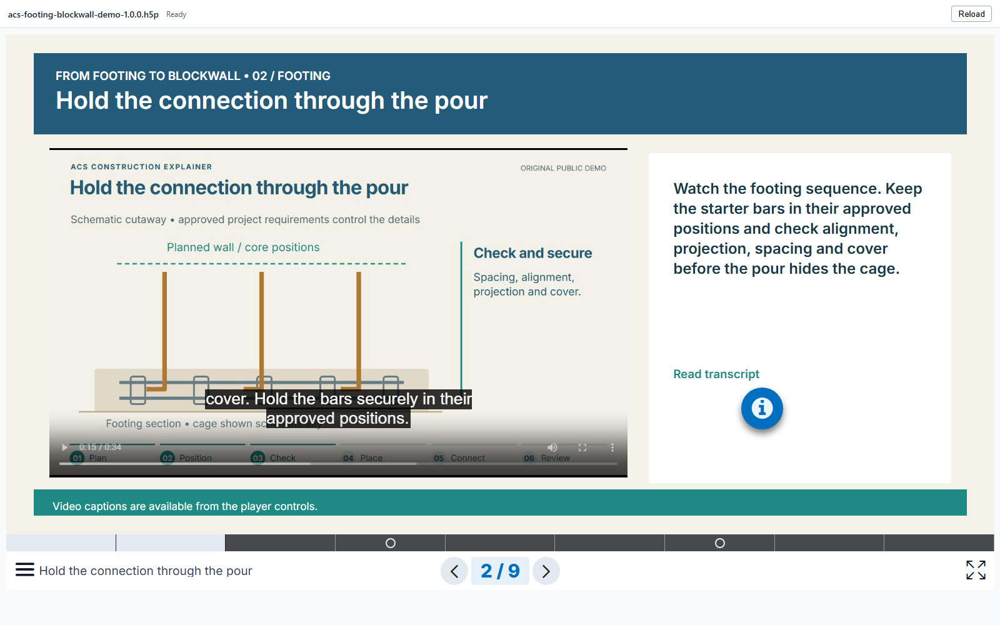
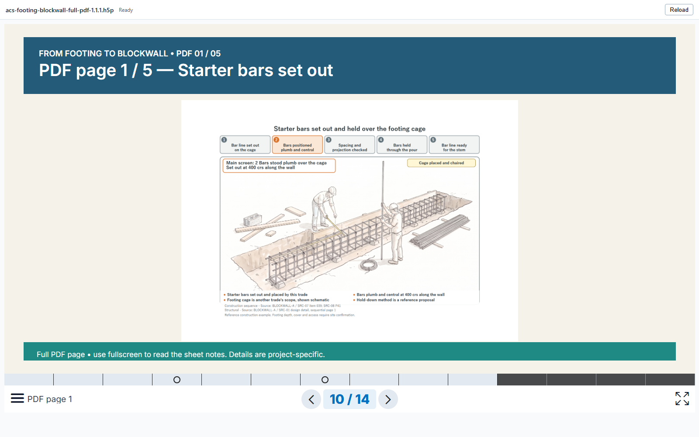

# From footing to blockwall

A working H5P sample for **ACS H5P Viewer for Directory Opus**, made with native H5P authoring, a local Lumi MCP bridge, HyperFrames animation and Qwen3-TTS voice cloning.

**[Download the H5P sample](acs-footing-blockwall-full-pdf-1.1.1.h5p)** — version 1.1.1, approximately 17.2 MB. On GitHub, open the file and choose **Download raw file**; save the binary `.h5p`, not the surrounding GitHub page.

**[How it was made →](HOW-IT-WAS-MADE.md)** is the introduction to the authoring workflow. **[Verification →](VERIFICATION.md)** explains what was tested and what still needs human review.

## Try it in Opus

To have an agent set up the viewer and this sample on your PC, copy the
[agent setup prompt](../../docs/AGENT-SETUP-PROMPT.md). It supports source builds
and prebuilt transfer packs.

1. Install and enable ACS H5P Viewer using the repository's [setup instructions](../../README.md#install-on-another-computer).
2. Download the sample to a local folder and select it in the Opus viewer pane.
3. Use the presentation arrows or slide menu to explore all fourteen slides.
4. Use fullscreen to inspect the notes on the five full-page illustrations.

The sample contains its media and required H5P libraries. It needs no internet connection for playback. MCP, HyperFrames, Qwen and Lumi were authoring tools; they are not prerequisites for viewing the finished lesson.

| Slides | What to try |
| --- | --- |
| 1, 3, 5, 8 | Play the synthetic narration and open **Read transcript**. |
| 2, 6 | Play the animated construction explainers, enable English captions and try seeking. |
| 4, 7 | Answer a question incorrectly, read the feedback, retry and answer correctly. |
| 9 | Review the five-stage sequence. |
| 10–14 | View the complete supplied PDF pages, with matching navy headers and teal footers. |

Switch to another file while audio or video is playing, then reopen the sample. The viewer should stop the previous lesson and start without saved learner progress. Autoplay is off.

## About the lesson

The conceptual sequence covers starter bars, a strip footing, the first course, further courses and core filling. Its recurring question is: **what must be checked before the next operation hides it?** The sample is a demonstration of interactive media delivery, not a structural design, site method statement or competency assessment. The original schematics are simplified and not to scale. Details printed on the added source sheets are project-specific; approved project documents control actual work.

The narration is synthetic speech generated locally with an authorised ACS voice reference. The reference recording is not distributed. The five supplied PDF pages were added after the original lesson was built; their artwork was not generated by HyperFrames or by the voice model.

The original lesson assets are CC BY 4.0; the added PDF pages retain their original rights and are not covered by that grant. H5P libraries retain their own licences. Read [LICENSE.md](LICENSE.md) before reusing assets; the repository's MIT code licence is not a blanket licence for this sample.

The package hash, media counts and library versions are recorded in [sample-manifest.json](sample-manifest.json). The narrated words are also available in [transcript.md](transcript.md).
